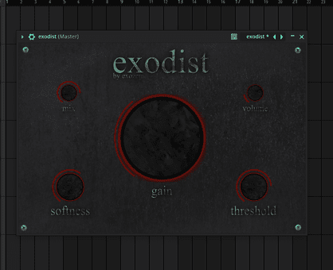
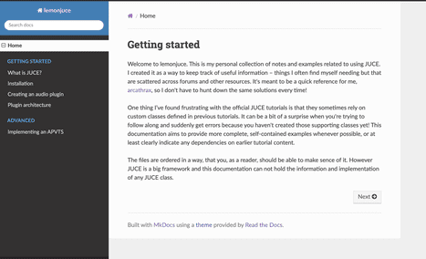

# projects

this is a list of all the projects that i've worked on.

---

## exodist

exodist is a custom audio effects plugin built with [JUCE](https://juce.com/), and more than just a project, it was an exploration—a chance to translate my musical ideas into code.  this was my first significant application development endeavor, and i'm proud of the result, even if the path to get there involved *many* revisions (let’s just say i’ve rewritten this plugin at least three times).

the process wasn't always smooth sailing. optimizing algorithms for real-time audio processing demanded a new level of precision, forcing me to confront challenges and learn from my mistakes.  i gained practical expertise in:

- **real-time optimization:** mastering techniques to minimize latency and ensure pristine audio quality.
- **c++ proficiency:** solidifying my understanding of c++ fundamentals and object-oriented design principles within the JUCE framework.
- **low-Level gui development:** crafting a custom user interface that’s both functional and aesthetically pleasing.
- **version control (git):** implementing robust Git workflows for collaborative development and tracking changes.
- **application packaging & distribution:** learning the intricacies of creating distributable packages, including DLL dependencies.
- **code signing:** Understanding and implementing code signing procedures for secure distribution.
- **documentation:** Creating clear and comprehensive documentation to facilitate understanding and future development.

this project taught me more than just technical skills; it instilled a deep appreciation for perseverance – the ability to push through frustration and emerge with something i'm truly proud of.  it’s a lesson i carry forward in my it apprenticeship and beyond.

[explore the project on github](https://github.com/arcathrax/exodist/releases)

---

## lemonjuce

lemonjuce is a collection of documentation designed to clarify and expand upon the [official juce tutorials](https://juce.com/learn/tutorials/). i found myself struggling with those tutorials, often needing to piece together information scattered across forums and other resources – things that weren't always readily apparent or easy to find.

the goal here is to provide a more structured overview of juce concepts, presented in a way that’s easier to understand and navigate than the existing documentation. it aims to bridge those gaps and offer a clearer path for learning juce. 

i'm not creating my own examples; instead, i'm focusing on explaining existing juce functionality with improved clarity and organization. think of it as a curated and reorganized reference guide to help you better grasp the fundamentals.

[explore lemonjuce here](https://github.com/arcathrax/lemonjuce)

---